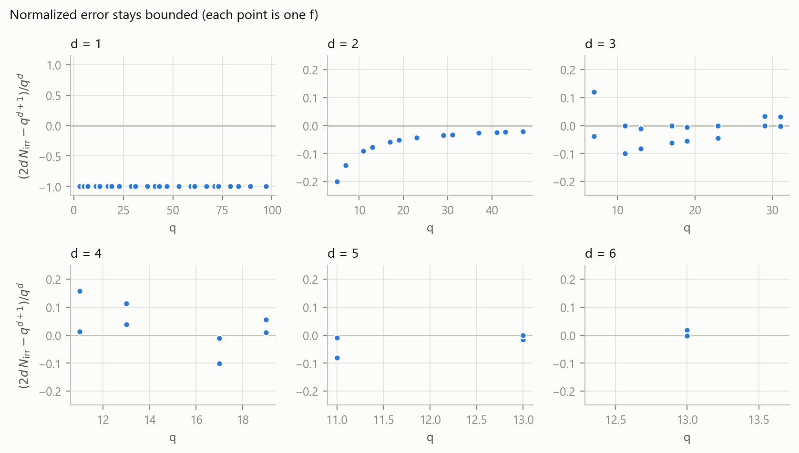
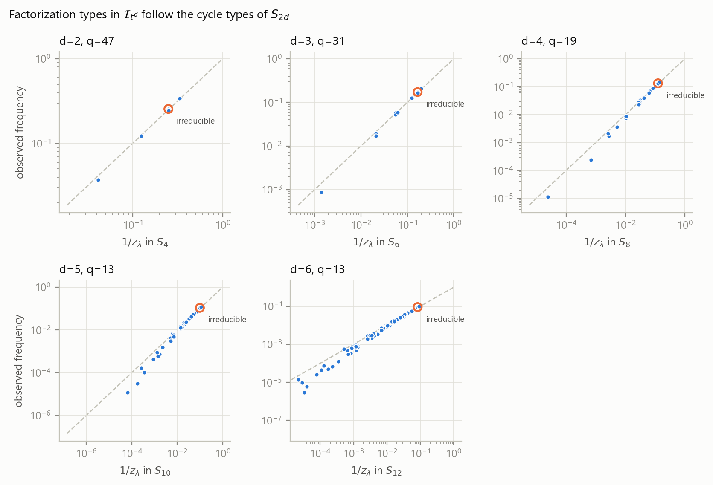
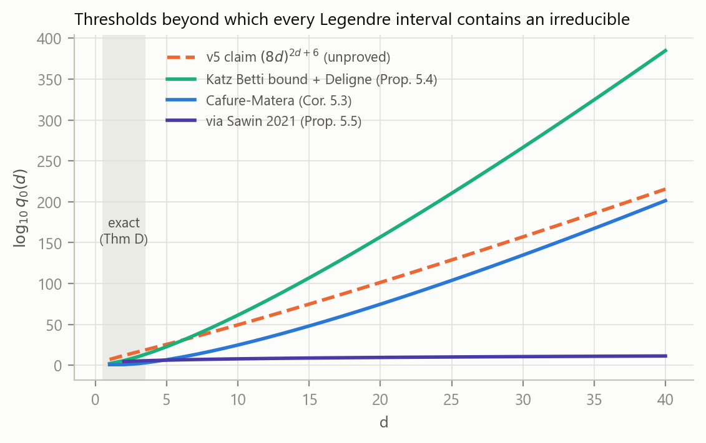

# Legendre's Conjecture in Function Fields

**Full monodromy, twisted root varieties, and explicit bounds.** This repository holds version v6 of the preprint, published on Zenodo as [10.5281/zenodo.23179113](https://doi.org/10.5281/zenodo.23179113). It revises v5, [10.5281/zenodo.18705744](https://doi.org/10.5281/zenodo.18705744), from February 2026.

[](https://doi.org/10.5281/zenodo.23179113)
[](https://doi.org/10.5281/zenodo.18705744)
[](https://creativecommons.org/licenses/by/4.0/)
[](LICENSE)

For monic $f\in\mathbb F_q[t]$ of degree $d$, the **Legendre interval**

$$\mathcal I_f=\lbrace f^2+s \;:\; \deg s\le d\rbrace,\qquad |\mathcal I_f|=q^{d+1},$$

is the function-field analogue of $[n^2,(n+1)^2]$. The question is how many irreducible polynomials it contains, and whether it always contains at least one.

## What changed from v5

v5 was reviewed in detail. The full referee report is in [`review/REVIEW_en.md`](review/REVIEW_en.md), with a Chinese version in [`review/REVIEW_zh.md`](review/REVIEW_zh.md). In short:

| Issue in v5 | Status in v6 |
|---|---|
| The main asymptotic $N_{\rm irr}=q^{d+1}/2d+O(q^{d+1/2})$ was presented as new. | It is a special case of Bank–Bary-Soroker–Rosenzweig, Duke 2015. This is now stated plainly. |
| The primitivity proof applied the decomposition criterion outside its scope. | Re-proved by isolating $a_0$ and applying Lüroth (Prop. 3.2). |
| The transposition proof misidentified the discriminant branches and needed $f$ squarefree. | New proof that does **not** need $f$ squarefree (Prop. 3.3). |
| The effective Chebotarev bound was stated with the permutation sheaf. | Replaced by an exact twisted-variety identity (Thm B). |
| The threshold $(8d)^{2d+6}$ rested on a Betti bound that is not in the cited source. | Replaced by proved explicit thresholds (Thm C, Cor. 5.3, Props. 5.4–5.5), compared with Sawin's 2021 short-interval bound. |
| The numerical evidence was three small examples. | Now 186 exact counts for $d\le6$, an exhaustive search over $f$, and a check of the identity. |

## Main results of v6

- **Theorem A.** If $p=\operatorname{char}\mathbb F_q>2d$, the geometric monodromy group of $f^2+\sum_{i\le d}a_it^i$ is $S_{2d}$, for every monic $f$.
- **Theorem B.** The count satisfies an exact identity $2d\,N_{\rm irr}=\#W(\mathbb F_q)-E$. Here $W$ is the explicit variety of $\beta\in\mathbb F_{q^{2d}}$ whose characteristic polynomial lies in $\mathcal I_f$. It has dimension $d+1$ and degree at most $(d-1)!$, and it is absolutely irreducible exactly when the monodromy group is $S_{2d}$. The correction term satisfies $0\le E<q^{d+1}/(q-1)$.
- **Theorem C.** Assume $p>2d$ and let $\delta=(d-1)!$. If $q>2(d+2)\delta^2$, then
  $$|2d\,N_{\rm irr}-q^{d+1}|<(\delta-1)(\delta-2)\,q^{d+1/2}+(5\delta^{13/3}+2)\,q^d.$$
  This follows from the Cafure–Matera explicit Lang–Weil bound. It gives $N_{\rm irr}\ge1$ for $q>q_0(d)$, for example $q_0(4)\approx1.65\cdot10^4$ and $q_0(5)\approx7.3\cdot10^6$.
- **Comparison with Sawin (2021).** Sawin's square-root cancellation theorem for short intervals ([Duke Math. J. 170 (2021)](https://arxiv.org/abs/1809.05137)) gives the stronger estimate
  $$|2d\,N_{\rm irr}-q^{d+1}|\le 6(2d+2)^{3d-1}q^{d/2+1}+dq+d^2\qquad(p>2d).$$
  This is Proposition 5.5, which combines Sawin's bound with Theorem B and a sharper bound on $E$. Its threshold is about $(2d+2)^6$, which beats Theorem C for every $d\ge5$; Theorem C remains better for $d=4$. Sawin's variety of ordered roots is the root variety $V$ of the paper, so Theorem B is a twisted form of his point count.
- **Theorem D.** For $d\le3$ there are closed formulas, valid for every admissible $q$:
  - $d=1$: $N_{\rm irr}=(q^2-q)/2$.
  - $d=2$: $N_{\rm irr}=(q^3-q)/4$.
  - $d=3$: a formula in terms of $\eta(2\Delta)$ and $\eta(-3)$, where $\Delta=c_2^2-3c_1$. It agrees with Kuz'min's count of irreducible sextics with two prescribed coefficients.

  So for $d\le3$ every Legendre interval contains an irreducible polynomial.

The case of fixed $q$ with $d\to\infty$ is the genuine analogue of Legendre's conjecture, and it remains **open**. It would require prescribing about half of the coefficients of an irreducible polynomial. After reversing polynomials, the Legendre interval becomes a residue class modulo $t^d$ at exactly level of distribution $1/2$. That is the same barrier as for the integers, where the Riemann hypothesis just fails to reach Legendre's conjecture.

## Repository layout

```
├── paper/
│   ├── Legendre_FF_v6.tex / .pdf     revised manuscript
│   ├── tables/*.tex                  tables generated from data/ by code/make_tables.py
│   └── archive/                      original Zenodo v5 (tex + pdf), unchanged
├── review/
│   ├── REVIEW_en.md                  referee report on v5 (English)
│   └── REVIEW_zh.md                  referee report on v5 (Chinese)
├── code/
│   ├── fflib.py                      numba-accelerated arithmetic over F_p; factorisation types; twisted count
│   ├── test_fflib.py                 tests (cross-check against trial division, closed forms, identity)
│   ├── interval_counts.py            exact N_irr and factorisation statistics   -> data/interval_counts.csv, data/factorization_types.csv
│   ├── twisted_identity.py           enumerate F_{q^{2d}}, verify Theorem B     -> data/twisted_identity.csv
│   ├── exhaustive_small.py           all f for small q (incl. p <= 2d)          -> data/exhaustive_min_counts.csv
│   ├── thresholds.py                 explicit thresholds q_0(d)                  -> data/thresholds.csv
│   ├── make_tables.py                LaTeX tables + results/summary.{md,json}
│   ├── make_figures.py               figures/*.pdf, *.png
│   └── run_all.py                    runs everything
├── data/                             CSV outputs (committed)
├── figures/                          fig1–fig4 (PDF + PNG)
├── results/                          summary.md, summary.json
├── CITATION.cff
├── requirements.txt
└── LICENSE                           CC BY 4.0 (paper, data, figures) + MIT (code)
```

## Reproducing

```bash
pip install -r requirements.txt
python code/run_all.py            # full pipeline, about 10 minutes (the d=6, q=13 counts dominate)
python code/run_all.py --quick    # tests + tables + figures from the committed CSVs
cd paper && pdflatex Legendre_FF_v6.tex && pdflatex Legendre_FF_v6.tex
```

All counts are over prime fields $q=p$. Each element of $\mathcal I_f$ is classified by distinct-degree factorisation. The implementation is cross-checked against naive trial division in `code/test_fflib.py`.

## Key numbers

The full tables are in [`results/summary.md`](results/summary.md).

- **Exact counts.** 186 triples $(d,q,f)$ with $1\le d\le6$. The smallest $N_{\rm irr}$ observed is 3, at $d=1,q=3$. There are 0 mismatches against Theorem D over all applicable rows.
- **Twisted identity.** $\#W(\mathbb F_q)=2d\,N_{\rm irr}+E$ holds in every enumerated case, for $d\le4$.
- **Exhaustive search.** Every $f$ was tried for $d\le6$ and small $q$, including $p\le2d$. No Legendre interval without an irreducible polynomial was found.
- **Factorisation types.** The observed frequencies match the $S_{2d}$ cycle-type probabilities $1/z_\lambda$. See `figures/fig3_factorization_types.png`.





## Citation

```bibtex
@misc{chen2026legendreff,
  author = {Ruqing Chen},
  doi    = {10.5281/zenodo.23179113},
  title  = {Legendre's Conjecture in Function Fields: Full Monodromy,
            Twisted Root Varieties, and Explicit Bounds},
  year   = {2026},
  note   = {Version v6; revises v5, doi:10.5281/zenodo.18705744},
  url    = {https://github.com/Ruqing1963/legendre-function-field}
}
```

## Key references

- E. Bank, L. Bary-Soroker, L. Rosenzweig, *Prime polynomials in short intervals and in arithmetic progressions*, Duke Math. J. 164 (2015), 277–295. [arXiv:1302.0625](https://arxiv.org/abs/1302.0625)
- A. Cafure, G. Matera, *Improved explicit estimates on the number of solutions of equations over a finite field*, Finite Fields Appl. 12 (2006), 155–185. [arXiv:math/0405302](https://arxiv.org/abs/math/0405302)
- N. M. Katz, *Sums of Betti numbers in arbitrary characteristic*, Finite Fields Appl. 7 (2001), 29–44.
- W. Sawin, *Square-root cancellation for sums of factorization functions over short intervals in function fields*, Duke Math. J. 170 (2021), 997–1026. [arXiv:1809.05137](https://arxiv.org/abs/1809.05137)
- W. Sawin, M. Shusterman, *On the Chowla and twin primes conjectures over F_q[T]*, Ann. of Math. 196 (2022). [arXiv:1808.04001](https://arxiv.org/abs/1808.04001)
- M. Lalín, O. Larocque, *The number of irreducible polynomials with the first two prescribed coefficients over a finite field*, Rocky Mountain J. Math. 46 (2016), 1587–1618.

## License

The paper, data, figures and review are released under CC BY 4.0. The code is released under MIT. See [LICENSE](LICENSE).
