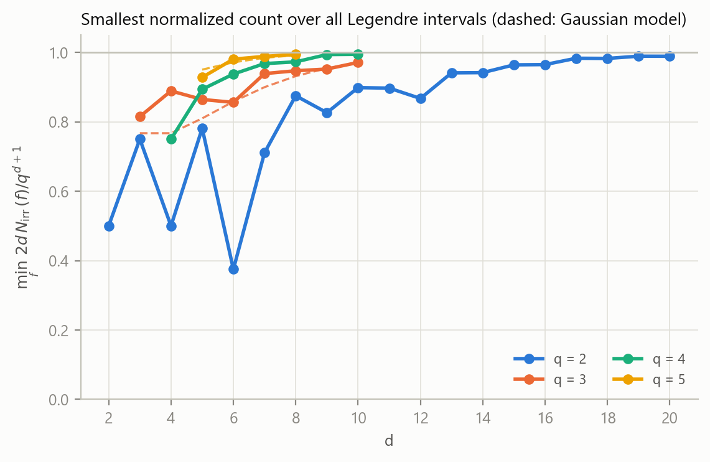
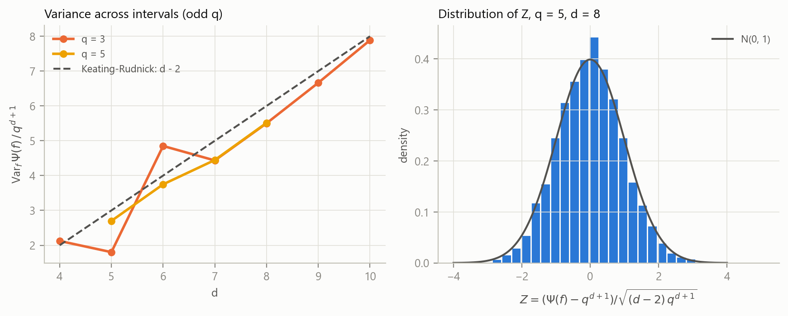

# Legendre's Conjecture in Function Fields

**The classical range, full monodromy, and the open range q ≤ d − 2.** This repository holds version v7 of the preprint *The Geometry of Prime Vacuums*, published on Zenodo as [10.5281/zenodo.23185896](https://doi.org/10.5281/zenodo.23185896). Earlier versions are v6, [10.5281/zenodo.23179113](https://doi.org/10.5281/zenodo.23179113), and v5, [10.5281/zenodo.18705744](https://doi.org/10.5281/zenodo.18705744).

[](https://doi.org/10.5281/zenodo.23185896)
[](https://doi.org/10.5281/zenodo.23179113)
[](https://doi.org/10.5281/zenodo.18705744)
[](https://creativecommons.org/licenses/by/4.0/)
[](LICENSE)

For monic $f\in\mathbb F_q[t]$ of degree $d$, the **Legendre interval**

$$\mathcal I_f=\lbrace f^2+s \;:\; \deg s\le d\rbrace,\qquad |\mathcal I_f|=q^{d+1},$$

is the function-field analogue of $[n^2,(n+1)^2]$. Does every Legendre interval contain an irreducible polynomial?

## Main results of v7

- **Theorem 1 (the classical range).** For every $q$ and every monic $f$ of degree $d\ge2$,
  $$\Bigl|\sum_{P\in\mathcal I_f}\Lambda(P)-q^{d+1}\Bigr|\le(d-2)(q^d-q).$$
  This is the explicit form of a classical estimate, from Hayes characters and Weil's theorem; see Hsu 1996, Cohen 2005 and Gao 2021. Together with a bound on prime powers it gives **$N_{\rm irr}\ge1$ whenever $q\ge d-1$, in every characteristic.** At $q=d-2$ the method gives nothing, the function-field form of "the Riemann hypothesis just misses Legendre's conjecture".
- **Theorem 2 (the open range, by computation).** Every Legendre interval contains an irreducible polynomial for $q=2$ with $d\le20$, $q=3$ with $d\le10$, $q=4$ with $d\le10$, and $q=5$ with $d\le8$. With Theorem 1, **the analogue of Legendre's conjecture holds for every $q$ when $d\le8$.** No empty Legendre interval was found anywhere.
- **Variance and a conjecture.** For odd $q$ the variance of the prime count across all Legendre intervals approaches the Keating–Rudnick value $(d-2)q^{d+1}$ already for $q=3$ and $q=5$, although it is proved only for $q\to\infty$. The smallest normalized count tends to $1$ as $d$ grows. This supports the **conjecture** that every Legendre interval, for every $q$ and $d$, contains an irreducible polynomial.
- **Kept from v6.** A self-contained proof that the monodromy group is $S_{2d}$ for $p>2d$, without assuming $f$ squarefree. An exact twisted-variety identity $\sum_{P\in\mathcal I_f}\Lambda(P)=\#W(\mathbb F_q)$. Closed formulas for $d\le3$, now including even $q$ for $d=2$.

## What changed

| Version | Status |
|---|---|
| v5 | Claimed the asymptotic as new and an unproved threshold $q>(8d)^{2d+6}$. Several proofs had gaps. See [`review/REVIEW_en.md`](review/REVIEW_en.md). |
| v6 | Fixed the proofs and gave rigorous thresholds, for example $q>1.65\cdot10^4$ for $d=4$, but **missed the classical estimate**, which gives $q\ge d-1$. |
| v7 | Builds on the classical estimate, locates the open range $q\le d-2$, and adds the open-range computations, the variance comparison and the conjecture. Appendix B of the paper lists the corrections to v6. |

## Repository layout

```
├── paper/
│   ├── Legendre_FF_v7.tex / .pdf     current manuscript
│   ├── tables/*.tex                  tables and number macros generated from data/ by code/make_tables.py
│   └── archive/                      v5 (Zenodo original) and v6, unchanged
├── review/
│   ├── REVIEW_en.md                  referee report on v5, with an addendum on v6 (English)
│   └── REVIEW_zh.md                  the same in Chinese
├── code/
│   ├── fqlib.py                      table-based F_q arithmetic (any q <= 16), Ben-Or test, orbits of Legendre intervals
│   ├── open_regime.py                Experiment 5: the open range q <= d - 2   -> data/open_regime_*.csv
│   ├── fflib.py                      prime-field factorisation types and twisted-variety enumeration
│   ├── interval_counts.py            exact N_irr in the classical range       -> data/interval_counts.csv, factorization_types.csv
│   ├── twisted_identity.py           check of #W(F_q) = sum of Lambda         -> data/twisted_identity.csv
│   ├── exhaustive_small.py           all f for small prime q                  -> data/exhaustive_min_counts.csv
│   ├── thresholds.py                 explicit thresholds of v5/v6 for comparison -> data/thresholds.csv
│   ├── small_q_gf.py                 slow pure-python F_q code used as an independent check
│   ├── test_fflib.py, test_fqlib.py  tests and cross-checks
│   ├── make_tables.py, make_figures.py, open_data.py, run_all.py
├── data/                             CSV outputs
├── figures/                          fig1–fig6 (PDF + PNG)
├── results/                          summary.md, summary.json
├── CITATION.cff, requirements.txt, LICENSE
```

## Reproducing

```bash
pip install -r requirements.txt
python code/run_all.py --quick    # tests, then tables and figures from the committed CSVs (a few minutes)
python code/run_all.py            # everything from scratch (about 2-3 hours on 8 cores)
cd paper && pdflatex Legendre_FF_v7.tex && pdflatex Legendre_FF_v7.tex
```

Every element of every Legendre interval in the open range is tested with Ben-Or's irreducibility test over table-based $\mathbb F_q$ arithmetic. The code is cross-checked in four ways:

- against an independent distinct-degree factorisation for prime $q$;
- against a pure-Python implementation for $q=4,8,9$;
- against the twisted-variety enumeration;
- against the exact identity that, for odd $q$, the prime counts over all intervals sum to $q^{2d}$.

## Figures




## Citation

```bibtex
@misc{chen2026legendreff,
  author = {Ruqing Chen},
  doi    = {10.5281/zenodo.23185896},
  title  = {Legendre's Conjecture in Function Fields: the Classical Range,
            Full Monodromy, and the Open Range $q\le d-2$},
  year   = {2026},
  note   = {Version v7; earlier versions doi:10.5281/zenodo.23179113 (v6), doi:10.5281/zenodo.18705744 (v5)},
  url    = {https://github.com/Ruqing1963/legendre-function-field}
}
```

## Key references

- D. R. Hayes, *The distribution of irreducibles in GF[q,x]*, Trans. AMS 117 (1965), 101–127.
- C. N. Hsu, *The distribution of irreducible polynomials in F_q[t]*, J. Number Theory 61 (1996), 85–96.
- S. D. Cohen, *Explicit theorems on generator polynomials*, Finite Fields Appl. 11 (2005), 337–357.
- Z. Gao, *Improved error bounds for the number of irreducible polynomials ... with prescribed coefficients*, [arXiv:2109.14154](https://arxiv.org/abs/2109.14154).
- J. P. Keating, Z. Rudnick, *The variance of the number of prime polynomials in short intervals and in residue classes*, IMRN 2014. [arXiv:1204.0708](https://arxiv.org/abs/1204.0708)
- E. Bank, L. Bary-Soroker, L. Rosenzweig, Duke Math. J. 164 (2015). [arXiv:1302.0625](https://arxiv.org/abs/1302.0625)
- W. Sawin, Duke Math. J. 170 (2021). [arXiv:1809.05137](https://arxiv.org/abs/1809.05137)
- W. Sawin, M. Shusterman, Ann. of Math. 196 (2022). [arXiv:1808.04001](https://arxiv.org/abs/1808.04001)

## License

The paper, data, figures and review are released under CC BY 4.0. The code is released under MIT. See [LICENSE](LICENSE).
